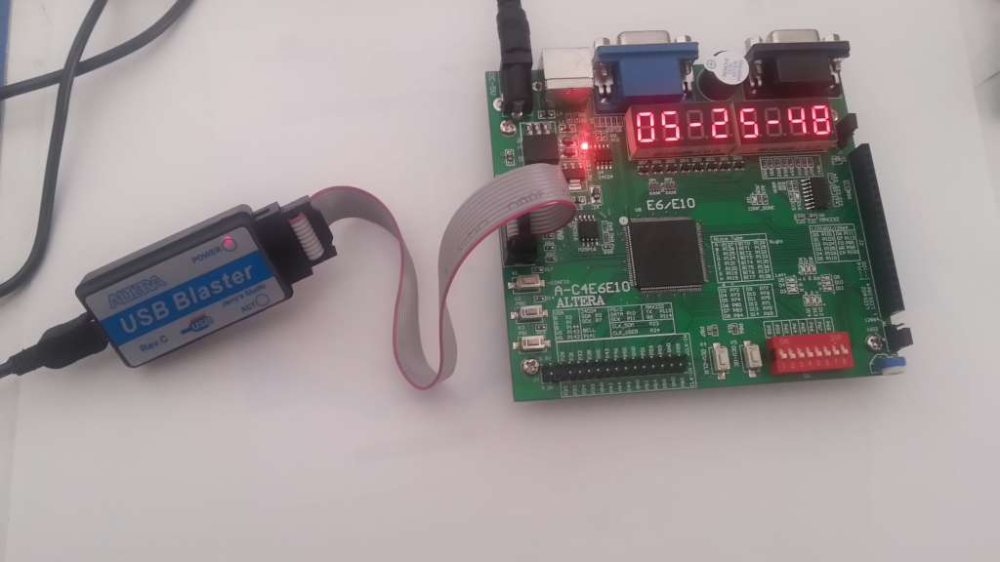

# 24 hour clock
First serious FPGA code running on a Chinese Low-Cost Cyclone IV Evaluation board A-C4E6E10 (https://www.aliexpress.com/item/USB-Blaster-altera-fpga-board-altera-kit-fpga-development-board-EP4CE6E22C8N-board-cyclone-IV-board/32813061054.html).

Developed on Quartus II version 13.1.4 web edition.

The left pushbutton K4 is acting as a Function key (Run -> Set Mins -> Set Hours -> Preview -> Run)  and the right pushbutton K5 is an Up key to set minutes and hours. 

This code isn't probably optimized, but it works ;-)
